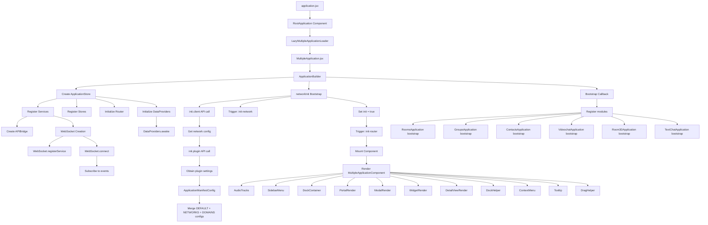
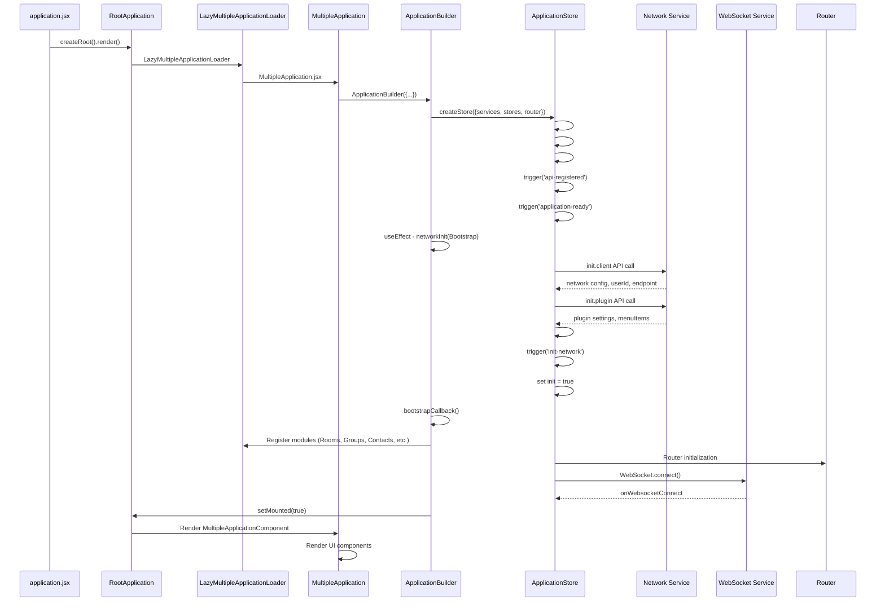
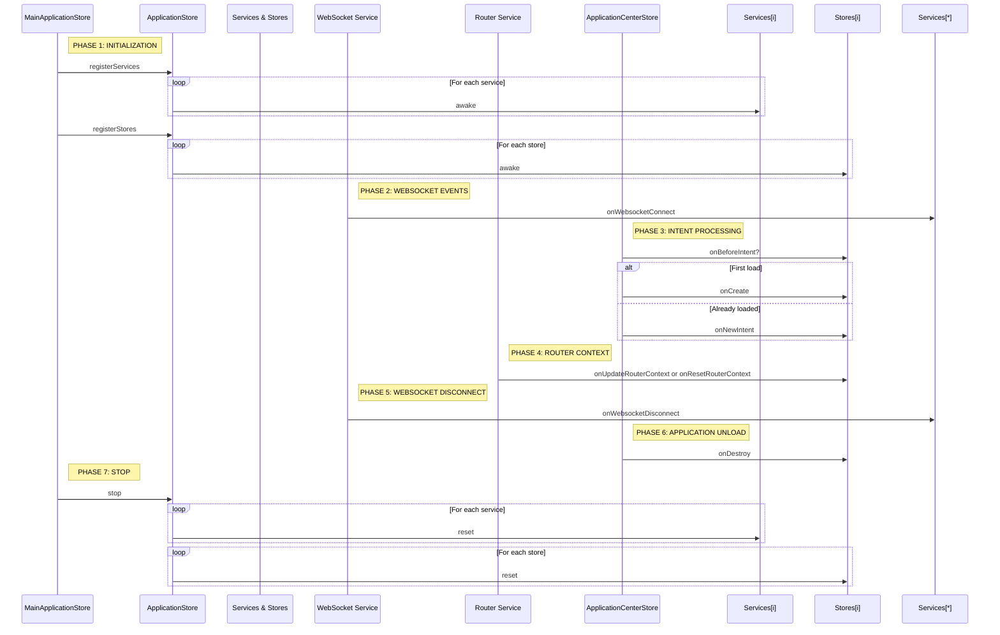

# Application Bootstrap Pipeline — Technical Specification

## Overview

The application initialization pipeline implements a sequential process for loading, registering, and activating system components. The process begins with mounting the root React component in src/application.jsx and concludes with rendering UI components after full initialization of services, stores, and WebSocket connection.

### Purpose

The pipeline ensures:
- Deterministic order of dependency initialization
- Centralized registration of services and stores through src/Stores/Application/ApplicationStore.js
- State synchronization between modules via WebSocket events
- Lazy loading of applications for performance optimization

### Entry Point

The launch process is initiated in src/application.jsx:

```javascript
createRoot(document.getElementById('root')).render(<RootApplication />)
```

`RootApplication` loads `LazyMultipleApplicationLoader`, which dynamically imports src/Applications/MultipleApplication/MultipleApplication.jsx.

---

## Architecture

### Pipeline Components

#### ApplicationBuilder

Application constructor that orchestrates initialization. Creates an instance of `ApplicationStore` with registered services, stores, and router.

**Responsibilities:**
- Instantiating `ApplicationStore`
- Launching `networkInit(Bootstrap)` to obtain network configuration
- Calling `bootstrapCallback()` after module loading completes
- Managing mounting state through `setMounted(true)`

#### ApplicationStore

Central hub for registration and lifecycle management of services and stores.

**Initialization Methods:**
- `#registerServices` — registers services in declaration order
- `#registerStores` — registers stores with API binding
- `#prepareDataProviders` — prepares data providers
- `trigger('api-registered')` — API ready event
- `trigger('application-ready')` — application ready event

#### Network Service

Service for managing network requests. Executes two sequential API calls:

1. **init.client** — obtains network configuration, userId, endpoint
2. **init.plugin** — obtains plugin settings and menuItems

Results are merged into `ApplicationManifestConfig` through DEFAULT + NETWORKS + DOMAINS config merge.

#### WebSocket Service

Manages real-time communication. After connection, calls `onWebsocketConnect` on all registered services, subscribing them to server events.

#### Router

Initialized after bootstrap process completion. Manages navigation context through `init-router` events.

### Component Interaction

```
application.jsx
    ↓ (createRoot)
RootApplication
    ↓ (lazy load)
LazyMultipleApplicationLoader
    ↓ (import)
MultipleApplication.jsx
    ↓ (constructor)
ApplicationBuilder
    ├→ ApplicationStore (#registerServices, #registerStores, #prepareDataProviders)
    ├→ Network Service (init.client → init.plugin → merge configs)
    └→ bootstrapCallback() → RegisterModules (Promise.allSettled)
        ↓
    Router initialization
        ↓
    WebSocket.connect() → onWebsocketConnect
        ↓
    setMounted(true) → Render UI components
```

---

## Pipeline Stages

### Phase 1: ApplicationStore Creation

**Trigger:** `ApplicationBuilder` initialization in src/Applications/MultipleApplication/MultipleApplication.jsx.

**Actions:**
1. Create `ApplicationStore` instance with passed services, stores, and router
2. Call `#registerServices` — register all services in declaration order
3. Call `#registerStores` — register all stores with API binding
4. Call `#prepareDataProviders` — prepare data providers
5. Event triggers:
   - `trigger('api-registered')` — API registered
   - `trigger('application-ready')` — application ready

**Completion Criteria:** All services and stores registered, DataProviders ready for operation.

### Phase 2: Network Bootstrap

**Trigger:** `useEffect` in `ApplicationBuilder`, calling `networkInit(Bootstrap)`.

**Actions:**
1. API call `init.client`:
   - Obtain network configuration
   - Extract userId and endpoint
2. API call `init.plugin`:
   - Obtain plugin settings
   - Extract menuItems for navigation
3. Merge configs into `ApplicationManifestConfig`:
   ```javascript
   ApplicationManifestConfig = merge(DEFAULT, NETWORKS, DOMAINS)
   ```

**Completion Criteria:** Network configuration loaded and merged.

### Phase 3: Initialization Triggers

**Trigger:** Completion of network configuration loading.

**Actions:**
1. `trigger('init-network')` — notification of network readiness
2. Set flag `init = true` in ApplicationStore

**Completion Criteria:** Initialization flag set, network ready for operation.

### Phase 4: Module Bootstrap

**Trigger:** Call to `bootstrapCallback()` after configuration loading completes.

**Actions:**
1. Register modules through `Promise.allSettled`:
   - RoomsApplication bootstrap
   - GroupsApplication bootstrap
   - ContactsApplication bootstrap
   - VideochatApplication bootstrap
   - Room3DApplication bootstrap
   - TextChatApplication bootstrap

**Completion Criteria:** All modules completed bootstrap (successfully or with errors).

### Phase 5: Router and WebSocket Initialization

**Trigger:** Completion of module bootstrap.

**Actions:**
1. `trigger('init-router')` — router initialization
2. Component mounting through `MountComponent`
3. WebSocket connection: `WebSocket.connect()`
4. Event subscription: `onWebsocketConnect` called on all services

**Completion Criteria:** Router initialized, WebSocket connected.

### Phase 6: UI Rendering

**Trigger:** Mounting flag set through `setMounted(true)`.

**Actions:**
Rendering components of src/Applications/MultipleApplication/Components/MultipleApplicationComponent.jsx:
- AudioTracks — audio track management
- SidebarMenu — side navigation menu
- DockContainer — application docking container
- PortalRender — portal rendering
- ModalRender — modal window rendering
- WidgetRender — widget rendering
- DetailViewRender — detail view rendering
- DockHelper — docking helper
- ContextMenu — context menu
- Tooltip — pop-up tooltips
- DragHelper — drag-and-drop helper

**Completion Criteria:** UI fully rendered, application ready for use.

---

## Lifecycle Methods

### Lifecycle Method Table

| # | Method | Phase | Purpose | Synchronicity |
|---|--------|-------|---------|---------------|
| 1 | `awake` | Initialization | Synchronous initialization after creation | Synchronous |
| 2 | `onWebsocketConnect` | WebSocket | Handle socket connection | Asynchronous |
| 3 | `onBeforeIntent` | Intent | Pre-validation (can abort) | Synchronous |
| 4 | `onCreate` | Intent | Create new application | Asynchronous |
| 5 | `onNewIntent` | Intent | Handle Intent for already opened app | Asynchronous |
| 6 | `onUpdateRouterContext` | Router | Update navigation context | Synchronous |
| 7 | `onResetRouterContext` | Router | Reset navigation context | Synchronous |
| 8 | `onWebsocketDisconnect` | WebSocket | Handle socket disconnection | Asynchronous |
| 9 | `onDestroy` | Unload | Cleanup when closing application | Asynchronous |
| 10 | `reset` | Stop | Asynchronous resource cleanup | Asynchronous |

### Method Invocation Sequence

```
PHASE 1: INITIALIZATION
    MainApplicationStore → ApplicationStore.registerServices()
        → Services[i].awake() [for each service]
    MainApplicationStore → ApplicationStore.registerStores()
        → Stores[i].awake() [for each store]

PHASE 2: WEBSOCKET EVENTS
    WebSocket Service → Services[*].onWebsocketConnect()

PHASE 3: INTENT PROCESSING
    ApplicationCenterStore → Stores[i].onBeforeIntent()?
        if first load:
            ApplicationCenterStore → Stores[i].onCreate()
        else:
            ApplicationCenterStore → Stores[i].onNewIntent()

PHASE 4: ROUTER CONTEXT
    Router Service → Stores[i].onUpdateRouterContext() or onResetRouterContext()

PHASE 5: WEBSOCKET DISCONNECT
    WebSocket Service → Services[*].onWebsocketDisconnect()

PHASE 6: APPLICATION UNLOAD
    ApplicationCenterStore → Stores[i].onDestroy()

PHASE 7: STOP
    MainApplicationStore → ApplicationStore.stop()
        → Services[i].reset() [for each service]
        → Stores[i].reset() [for each store]
```

---

## Configuration

### ApplicationManifestConfig

Application configuration is formed through merging three sources:

1. **DEFAULT** — default base settings
2. **NETWORKS** — network-specific settings
3. **DOMAINS** — domain settings

```javascript
ApplicationManifestConfig = merge(
  DEFAULT_CONFIG,
  NETWORKS_CONFIG,
  DOMAINS_CONFIG
)
```

### Bootstrap Parameters

| Parameter | Type | Description | Required |
|-----------|------|-------------|----------|
| `services` | Object[] | Array of services for registration | Yes |
| `stores` | Object[] | Array of stores for registration | Yes |
| `router` | Router | Router instance | Yes |
| `bootstrapCallback` | Function | Callback after module loading completion | No |

### ApplicationStore Events

| Event | Trigger | Description |
|-------|---------|-------------|
| `api-registered` | API registration completion | All APIs registered and ready for use |
| `application-ready` | Store initialization completion | Application ready for operation |
| `init-network` | Network configuration loading | Network initialized, flag init = true |
| `init-router` | Router initialization | Router ready for navigation handling |

---

## Usage

### Service Registration

Service is registered in ApplicationStore through the `services` array:

```javascript
const store = new ApplicationStore({
  services: [
    { name: 'WebSocket', instance: WebSocketService },
    { name: 'Network', instance: NetworkService }
  ],
  stores: [...],
  router: ...
})
```

Service is called through `parentStore.services[NAME]` in shell applications.

### Lifecycle Method Implementation

Store must implement lifecycle methods for pipeline integration:

```javascript
class MyStore extends Store {
  awake() {
    // Synchronous initialization
  }

  onWebsocketConnect() {
    // Subscribe to WebSocket events
  }

  onBeforeIntent(intent) {
    // Pre-validation, can return false to abort
    return true;
  }

  onCreate(intent) {
    // Create application on first load
  }

  onNewIntent(intent) {
    // Handle Intent for already opened application
  }

  onUpdateRouterContext(context) {
    // Update navigation context
  }

  onDestroy() {
    // Cleanup when closing application
  }

  reset() {
    // Asynchronous resource cleanup
  }
}
```

### Bootstrap Error Handling

Module bootstrap uses `Promise.allSettled`, allowing continued loading even with individual module errors:

```javascript
const results = await Promise.allSettled([
  RoomsApplication.bootstrap(),
  GroupsApplication.bootstrap(),
  ContactsApplication.bootstrap()
]);

results.forEach(result => {
  if (result.status === 'rejected') {
    console.error('Bootstrap failed:', result.reason);
  }
});
```

### Pipeline Debugging

Enable Developer Mode to track initialization events:

```javascript
import { DeveloperMode } from '@/Utils/DeveloperMode';

DeveloperMode.enable(); // Enables pipeline event logging
```

Events are logged in execution order:
1. `api-registered`
2. `application-ready`
3. `init-network`
4. `init-router`
5. WebSocket connection events

---

## Diagrams

### Overall Launch Architecture

Diagram shows initialization flow from entry point to UI rendering:



**Diagram Explanations:**
- **application.jsx** — application entry point, mounts RootApplication through React.createRoot()
- **LazyMultipleApplicationLoader** — dynamically loads MultipleApplication for initial load optimization
- **ApplicationBuilder** — orchestrates ApplicationStore creation and dependency initialization
- **ApplicationStore** — central hub for service, store, and router registration
- **Network Bootstrap** — executes sequential API calls to obtain network and plugin configuration
- **Bootstrap Callback** — launches parallel module loading through Promise.allSettled
- **WebSocket.connect** — establishes real-time connection after bootstrap completion

### ApplicationStore Initialization Sequence

Diagram shows detailed call flow during ApplicationStore initialization:



**Diagram Explanations:**
- **createRoot().render()** — React 18 API for mounting root component
- **#registerServices / #registerStores** — private ApplicationStore methods for dependency registration
- **trigger('api-registered')** — event signaling API readiness
- **networkInit(Bootstrap)** — useEffect hook initiating network configuration loading
- **merge configs** — merging DEFAULT, NETWORKS, and DOMAINS configs into ApplicationManifestConfig
- **bootstrapCallback()** — callback after module loading completion
- **setMounted(true)** — flag for UI rendering readiness

### Initialization Lifecycle

State diagram shows state transitions during initialization:

```mermaid
stateDiagram-v2
    [*] --> Loading: application.jsx mounted
    Loading --> CreatingStore: ApplicationBuilder creates ApplicationStore
    CreatingStore --> RegisteringServices: #registerServices()
    RegisteringServices --> RegisteringStores: #registerStores()
    RegisteringStores --> InitializingDataProviders: #prepareDataProviders()
    InitializingDataProviders --> NetworkBootstrap: networkInit(Bootstrap)
    
    NetworkBootstrap --> FetchingClientConfig: init.client API
    FetchingClientConfig --> FetchingPluginConfig: init.plugin API
    FetchingPluginConfig --> MergingConfigs: ApplicationManifestConfig
    
    MergingConfigs --> TriggerInitNetwork: trigger('init-network')
    TriggerInitNetwork --> BootstrapCallback: bootstrapCallback()
    
    BootstrapCallback --> RegisterModules: Promise.allSettled bootstraps
    RegisterModules --> InitRouter: Router initialization
    InitRouter --> ConnectWebSocket: WebSocket.connect()
    
    ConnectWebSocket --> SubscribeEvents: onWebsocketConnect
    SubscribeEvents --> MountComponent: setMounted(true)
    MountComponent --> RenderingUI: MultipleApplicationComponent
    
    RenderingUI --> [*]: Application Ready
```



**Diagram Explanations:**
- **Loading** — initial state after application.jsx mounting
- **CreatingStore** — creating ApplicationBuilder and ApplicationStore instances
- **RegisteringServices / RegisteringStores** — dependency registration in declaration order
- **InitializingDataProviders** — preparing data providers through DataProviders.awake()
- **NetworkBootstrap** — launching network bootstrap through networkInit(Bootstrap)
- **FetchingClientConfig / FetchingPluginConfig** — sequential API calls for configuration retrieval
- **MergingConfigs** — merging configs into ApplicationManifestConfig
- **TriggerInitNetwork** — triggering init-network event after network loading
- **RegisterModules** — parallel module loading through Promise.allSettled
- **ConnectWebSocket** — WebSocket connection after router initialization
- **SubscribeEvents** — calling onWebsocketConnect on all services
- **MountComponent** — setting mounting flag for UI rendering

### Simplified Lifecycle Sequence Diagram

Diagram shows lifecycle method invocation order across different phases:



**Diagram Explanations:**
- **PHASE 1: INITIALIZATION** — synchronous initialization of services and stores through awake()
- **PHASE 2: WEBSOCKET EVENTS** — WebSocket connection handling, calling onWebsocketConnect on all services
- **PHASE 3: INTENT PROCESSING** — Intent handling: onBeforeIntent for validation, onCreate/onNewIntent for application creation or update
- **PHASE 4: ROUTER CONTEXT** — navigation context update through onUpdateRouterContext/onResetRouterContext
- **PHASE 5: WEBSOCKET DISCONNECT** — WebSocket disconnection handling
- **PHASE 6: APPLICATION UNLOAD** — cleanup on application closure through onDestroy()
- **PHASE 7: STOP** — asynchronous resource cleanup through reset()

---

## Dependencies and Requirements

### External Dependencies

| Dependency | Purpose | Version |
|------------|---------|---------|
| React | UI framework | 18.x |
| ReactDOM | DOM rendering | 18.x |

### Internal Dependencies

| Module | Depends On | Required For |
|--------|------------|--------------|
| ApplicationStore | Services, Stores, Router | Registration and lifecycle management |
| Network Service | API client | Obtaining network configuration |
| WebSocket Service | Network config | Real-time connection |
| Router | ApplicationStore | Navigation and routing context |

### Runtime Requirements

- **Browser:** Modern browser with ES2015+ and React 18 support
- **Network:** Stable internet connection for API calls and WebSocket
- **Storage:** LocalStorage for state persistence (optional)

---

## Performance Notes

### Lazy Loading

Modules are loaded through `LazyMultipleApplicationLoader`, enabling:
- Reduced initial bundle size
- On-demand application loading only when needed
- Parallel module bootstrap execution through `Promise.allSettled`

### API Call Optimization

API calls execute sequentially to minimize server load:
1. `init.client` — obtain base configuration
2. `init.plugin` — obtain plugin settings

Results are cached in `ApplicationManifestConfig`.

### Mounting State Management

The `mounted` flag controls UI rendering until initialization completion:
- `setMounted(false)` — blocks rendering during loading
- `setMounted(true)` — enables rendering after all dependencies are ready

---

## Error Handling

### Bootstrap Error Strategy

Module bootstrap uses `Promise.allSettled`, enabling:
- Continued loading despite individual module errors
- Error logging without process interruption
- Application state preservation in partially loaded form

### WebSocket Error Handling

On WebSocket disconnection, `onWebsocketDisconnect` is called on all services. Services must:
- Clear event subscriptions
- Preserve local state
- Implement reconnection mechanism

### API Error Handling

API calls in Network Bootstrap are handled through try/catch:

```javascript
try {
  const clientConfig = await init.client();
  const pluginConfig = await init.plugin();
} catch (error) {
  console.error('Bootstrap failed:', error);
  // Error handling
}
```

---

## Versioning and Compatibility

### Version Compatibility

| Component | Minimum Version | Recommended Version |
|-----------|-----------------|---------------------|
| React | 18.0.0 | 18.2.0 |
| Node.js (build) | 16.x | 18.x |

### Breaking Changes

When modifying the initialization pipeline:
- Update documentation for all dependent modules
- Verify compatibility with existing applications
- Add migration scripts if necessary

---

## File Index

| File | Description |
|------|-------------|
| src/application.jsx | Application entry point, RootApplication mounting |
| src/Applications/MultipleApplication/MultipleApplication.jsx | Main component for multiple applications |
| src/Stores/Application/ApplicationStore.js | Application constructor, initialization orchestration |
| src/Stores/Application/ApplicationStore.js | Central hub for service and store registration |
| src/Services/Network/NetworkService.js | Network request management and configuration |
| src/Services/WebSocket/WebSocket.js | Real-time connection through WebSocket |
