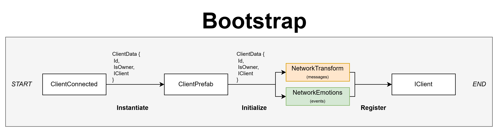
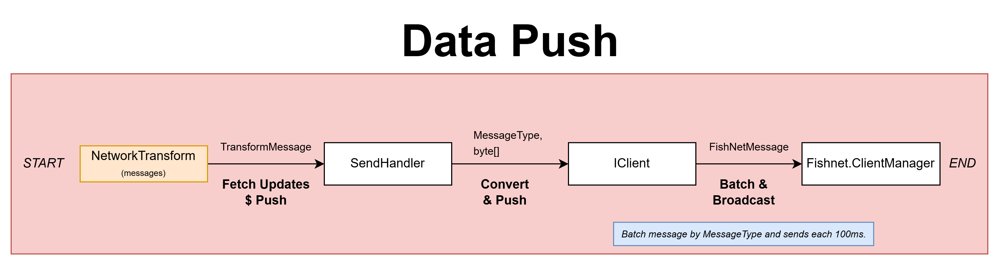
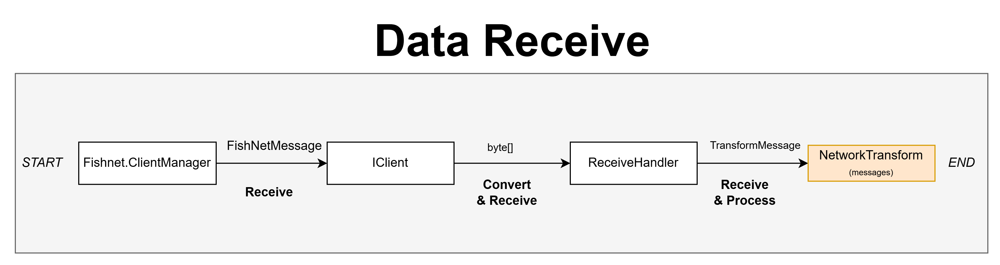
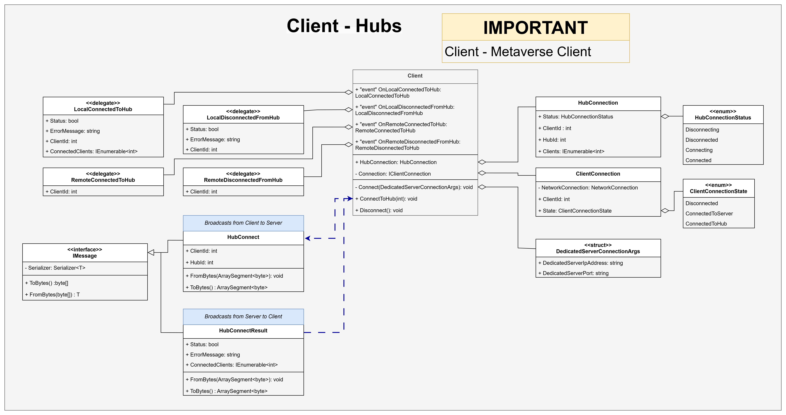

## Netcode Client Architecture

The "Client General" UML diagram illustrates Netcode client-side architecture with related entities (classes, interfaces, structures). This is a high-level wrapper for [FishNet](https://github.com/FirstGearGames/FishNet) open-source solution.

### 1. Overview
The idea to have client-authoritive flexible design that allows: scale kind/size of data without changes on server-side, keep Netcode code clean from concrete implementations, have different type of data independent of from each other when transfer and have a maximum control over data that system transfers.

### 2. Intro
Diagram uses UML standarts to show data flows, dependencies between entities and general contracts. Diagram has few groups of blocks:
1. **Core** (top part: ICLient, Receive/SendHandler, MessageQueue and IEvents).
2. **FishNet and Valusocial** (left part: FishNet.ClientManager, FishNetMessage, ValusocialHubManager etc).
3. **Receivers and Senders**  (center part: IReceiver, ISender, IEventsReceiver etc).
4. **Transform**  (bottom right part: example of Receiver and Sender to sync object position and rotation)
5. **Emotion** (bottom left part: example of IEventReceiver to broadcast avatar emotions/reactions)

---

### 3. Flows

### 3.1 Bootstrap

- The process begins when a **ClientConnected** event occurs, signaling that a new client has joined the network. At this point, a `ClientData` object is created, containing essential information such as the client’s unique `Id`, ownership flag (`IsOwner`), and a reference to the `IClient` interface. This data is then used to **instantiate** a `ClientPrefab`, representing the runtime instance of the connected user within the system.
- Once the prefab is instantiated, it moves to the **initialization** phase, where two key network components — **NetworkTransform** and **NetworkEmotions** — are initialized.  
- **NetworkTransform** handles positional and rotational updates across the network via serialized messages.  
- **NetworkEmotions** manages event-based emotion synchronization, allowing real-time expressive communication between clients.
- After initialization, both components are **registered** with the `IClient` interface, which completes the setup. The client is now fully integrated into the session and capable of sending and receiving network updates.

Overall, the sequence follows three main stages:
1. **Instantiate** — Create and configure the client’s prefab instance.  
2. **Initialize** — Set up core communication modules for transform and emotion synchronization.  
3. **Register** — Bind modules to the `IClient` system for network participation.

This ensures each new client becomes a synchronized, event-aware participant in the connected environment.

#### 3.2 Push Flow

- The process begins with the **NetworkTransform** component, which continuously **fetches local transform updates** — including position and rotation — and prepares them for network transmission. These updates are encapsulated into a `TransformMessage` structure that holds the serialized state of the client’s transform.
- The `TransformMessage` is then passed to the **SendHandler**, where it is **converted and pushed** into a message format suitable for network communication. The `SendHandler` transforms the message into a `MessageType` and `byte[]` payload, ensuring it can be interpreted consistently across different clients.
- Next, the serialized data flows through the **IClient** interface, which handles message **batching and dispatch preparation**. Here, multiple messages of the same type are grouped together by `MessageType` to reduce network overhead and optimize transmission.
- Finally, the batched data is passed to the **FishNet.ClientManager**, which performs the **broadcast operation**. Messages are **batched and sent every 100 milliseconds**, ensuring regular and efficient synchronization of transform data across all connected peers.

In summary, the sequence covers three major stages:
1. **Fetch & Push** — NetworkTransform gathers transform changes and encapsulates them in `TransformMessage`.  
2. **Convert & Prepare** — SendHandler and IClient serialize and batch messages by type.  
3. **Broadcast** — FishNet.ClientManager sends aggregated updates at fixed intervals (100ms).

This design ensures efficient, low-latency transform synchronization across networked clients while minimizing bandwidth usage through intelligent batching and timed dispatch.

#### 3.3 Receive Flow

- The process begins with the **FishNet.ClientManager**, which acts as the primary entry point for network communication. It continuously listens for incoming **FishNetMessage** packets from other clients or the server. When a message arrives, it is passed to the **IClient** interface for processing.
- Within **IClient**, the raw `FishNetMessage` is **converted and received** as a byte stream (`byte[]`). The `IClient` acts as a bridge that translates the network protocol data into a form that can be handled by the client-side components.  
- Next, the byte array is forwarded to the **ReceiveHandler**, which performs **deserialization** and reconstructs the data into a strongly typed `TransformMessage`. This message contains the updated positional and rotational data that needs to be applied to the client’s networked entities.
- Finally, the **NetworkTransform** component consumes the `TransformMessage`, **processing and applying** the received updates to synchronize the local representation of the entity with the remote state. This ensures all clients maintain a consistent spatial view across the network.

In summary, the sequence follows three main stages:
1. **Receive** — FishNet.ClientManager collects incoming network packets.  
2. **Convert & Deserialize** — IClient and ReceiveHandler convert byte data into structured messages.  
3. **Process & Apply** — NetworkTransform updates the local entity’s transform based on received data.

This receive pipeline provides a reliable and efficient mechanism for keeping all clients synchronized in real-time through consistent message handling and transform application.

---

### 4. Hubs

#### 4.1 Overview

Each **Client** manages hub connections through events, message exchanges, and status tracking.  
It maintains a `HubConnection` for hub state and a `ClientConnection` for the low-level network link, using delegates to handle connection and disconnection events.

#### 4.2 Core Components

- **Client** — Coordinates all hub-related actions.  
  - Methods: `Connect()`, `ConnectToHub()`, and `Disconnect()`.  
  - Events:  
    - `LocalConnectedToHub` / `LocalDisconnectedFromHub`  
    - `RemoteConnectedToHub` / `RemoteDisconnectedFromHub`

- **HubConnection** — Tracks current connection details: `Status`, `ClientId`, `HubId`, and connected clients.

- **ClientConnection** — Manages direct network state (`ClientConnectionState`).

- **DedicatedServerConnectionArgs** — Contains the server’s address and port for connection setup.

#### 4.3 Message Flow

Hub communication uses two main messages:

- **HubConnect** (Client → Server)  
  Contains `ClientId` and `HubId`, serialized via the `IMessage` interface.  

- **HubConnectResult** (Server → Client)  
  Returns `Status`, `ErrorMessage`, and the list of connected clients.

Both implement standardized `ToBytes()` and `FromBytes()` methods for reliable serialization.

#### 4.4 Connection States

- **HubConnectionStatus**: `Disconnecting`, `Disconnected`, `Connecting`, `Connected`  
- **ClientConnectionState**: `Disconnected`, `ConnectedToServer`, `ConnectedToHub`

These ensure deterministic synchronization between local and remote peers.

#### 4.5 Workflow Summary

1. Client calls `ConnectToHub()`.  
2. Sends a `HubConnect` message to the server.  
3. Receives a `HubConnectResult` confirming status.  
4. Triggers connection events (`LocalConnectedToHub`, etc.).  
5. Updates `HubConnection` and `ClientConnection` states.

This event-driven structure provides consistent and scalable hub management across all connected clients.
