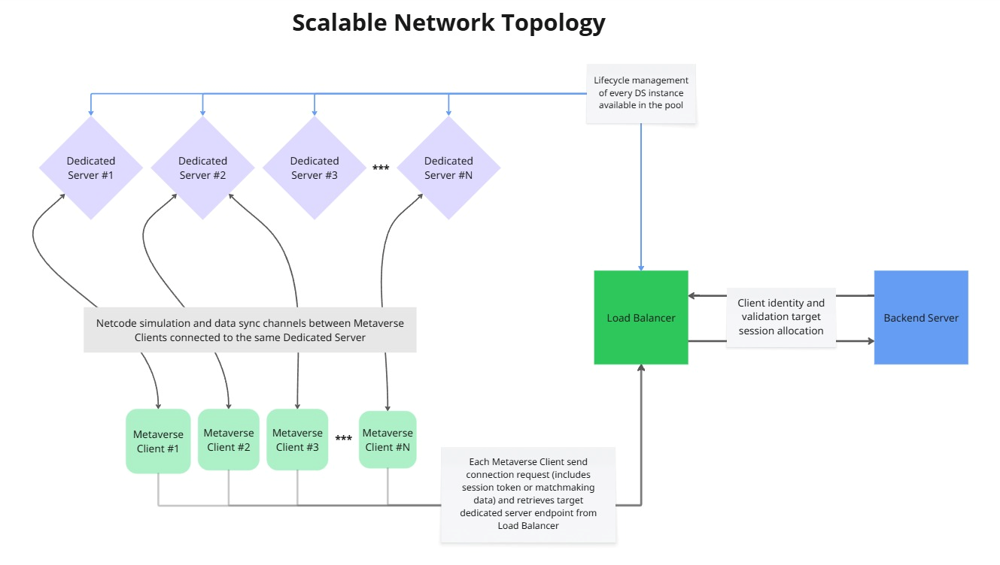
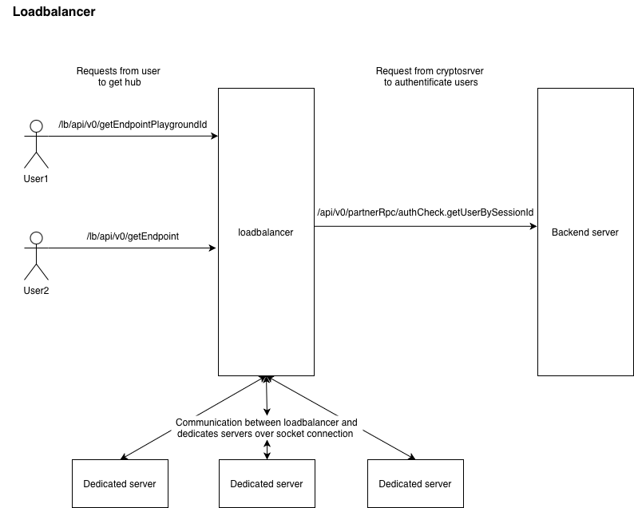

## Scalable Network Topology

The diagram illustrates a scalable network architecture designed to support multiple concurrent metaverse clients through a distributed server system.
It highlights the relationship between clients, dedicated servers, the load balancer, and the backend server.

### Overview

Each Metaverse Client connects to one of several Dedicated Servers, which handle real-time simulation, state replication, and local session logic.
The dedicated servers are organized in a horizontally scalable manner — additional servers can be added (up to N) to accommodate higher player loads or isolated simulation contexts.

### Components

- **Metaverse Clients (#1…#N)**
Represent user instances connected to the metaverse. Each client maintains a persistent connection to a specific dedicated server responsible for its simulation context.

- **Dedicated Servers (#1…#N)**
Handle session-level logic such as synchronization, entity management, and authority delegation.
Each dedicated server operates independently but follows a shared communication protocol for interoperability.

- **Load Balancer**
Serves as the entry point for all incoming client connections. It distributes load evenly across the available dedicated servers to prevent overload and ensure optimal resource utilization.
The load balancer also routes backend-related requests between servers and the backend service layer.

- **Backend Server**
Manages persistent data and global services such as authentication, matchmaking, player profiles, and analytics.
Communication between the backend server and load balancer ensures consistent data exchange and global session awareness.

### Data Flow

**1. Client Initialization**

Each metaverse client initiates a connection through the Load Balancer, which authenticates the request and selects an appropriate Dedicated Server based on current load and session requirements.

**2. Server Assignment**

The load balancer forwards the client to a chosen dedicated server. The client establishes a persistent session channel, typically via reliable UDP or WebSocket-based transport.

**3. Session Synchronization**

Once connected, the dedicated server synchronizes the initial world state, player entities, and session parameters with the client. This ensures deterministic state alignment across participants.

**4. Real-Time Communication**

During gameplay, the client sends input and state updates to the dedicated server.
The server processes these updates, applies simulation logic, and broadcasts the resulting authoritative state changes to other connected clients within the same session.

**5. Backend Interaction**

The dedicated server and load balancer exchange messages with the Backend Server to handle persistent actions:

- Authentication and authorization

- Matchmaking and session allocation

- Player data persistence and analytics

- Cross-server messaging or global events

**6. Scalability and Recovery**
When the system detects increased load or a failed server, the load balancer dynamically reassigns clients to new or available dedicated servers.
The backend ensures state consistency and session continuity during transitions.

### Summary

This architecture provides a modular and scalable networking model that separates real-time simulation (dedicated servers) from persistent data management (backend).
By routing all communication through the load balancer, the system achieves both horizontal scalability and fault isolation — ensuring reliable, low-latency experiences even under variable network conditions.

## Client Connection Sequence

The following sequence outlines the communication flow when a new client connects to the system:

- Metaverse Client → Load Balancer:
    Sends connection request (includes session token or matchmaking data)

- Load Balancer → Backend Server:
    Validates client identity and retrieves target session allocation

- Backend Server → Load Balancer:
    Returns dedicated server assignment and connection parameters

- Load Balancer → Metaverse Client:
    Provides target dedicated server endpoint

- Metaverse Client → Dedicated Server:
    Establishes direct connection and performs handshake

- Dedicated Server → Metaverse Client:
    Confirms session acceptance and sends initial synchronization data

**Result:**
The client is now fully connected to its assigned dedicated server with synchronized state, ready to exchange real-time updates.

## Load Balancer Architecture

### Overview

The diagram illustrates the **Load Balancer** component of the Netcode architecture.
It acts as the **entry point for all client connections** and manages **endpoint resolution, user authentication**, and **session routing** between the backend and dedicated servers.
This design ensures scalability, secure access control, and dynamic load distribution across multiple dedicated servers.

### Components

- **Users (User1, User2)**

  Represent external clients or game instances initiating connections to the system.
Each user communicates with the load balancer via REST API endpoints to obtain connection details for the appropriate hub or dedicated server.

- **Load Balancer**

  Central routing node responsible for:

    - Handling incoming client requests (`/lb/api/v0/getEndpoint`, `/lb/api/v0/getEndpointPlaygroundId`)

    - Communicating with the Backend Server to authenticate users and retrieve session data

    - Managing active socket connections with Dedicated Servers to allocate users efficiently

    - Monitoring server load and maintaining balanced client distribution

- **Backend Server**

  Provides authentication, session validation, and persistent data management.
The load balancer queries it through `/api/v0/partnerRpc/authCheck.getUserBySessionId` to verify user credentials and session state.

- **Dedicated Servers**

  Handle real-time sessions, world simulation, and state synchronization.
They maintain persistent socket connections with the load balancer, which routes players to the most suitable instance.

### Request Flow

1. **Client Connection Request**

- The client (User1 or User2) sends a REST request to the load balancer:
    - `/lb/api/v0/getEndpointPlaygroundId` — used when the client connects to a specific session or “playground”
    - `/lb/api/v0/getEndpoint` — used for general or matchmaking-based connections

2. **Authentication**

- Upon receiving a request, the load balancer calls the backend server using:
    - `/api/v0/partnerRpc/authCheck.getUserBySessionId`
- This verifies the client’s session and ensures it is valid before proceeding.

3. **Server Allocation**

- After authentication, the load balancer determines which Dedicated Server should handle the connection.
- The decision is based on availability, server load, and current session mappings.

4. **Socket Communication**

- The load balancer maintains an active socket-based communication channel with all dedicated servers.
- This allows for:
    - Low-latency data exchange
    - Real-time monitoring of server status
    - Fast reassignment or recovery in case of disconnection or failure

### Key Points

- The load balancer is stateless in terms of game logic — it routes and authenticates but does not simulate gameplay.

- Authentication is fully delegated to the backend service for consistency and centralized security.

- Dedicated servers are dynamically assigned and can scale horizontally to support multiple concurrent sessions.

- Communication between the load balancer and servers is persistent and bidirectional, enabling real-time load updates.
