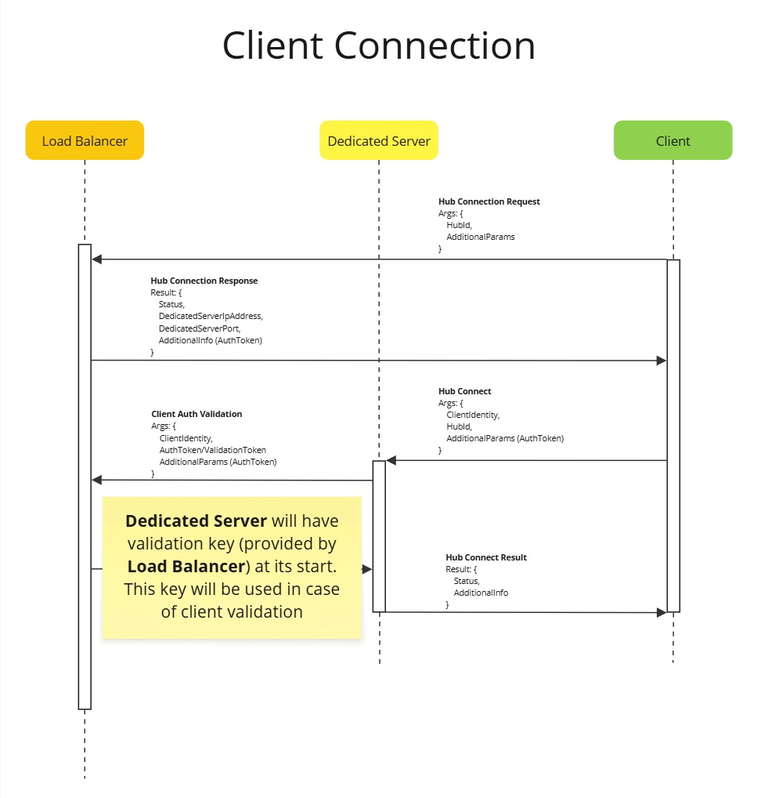
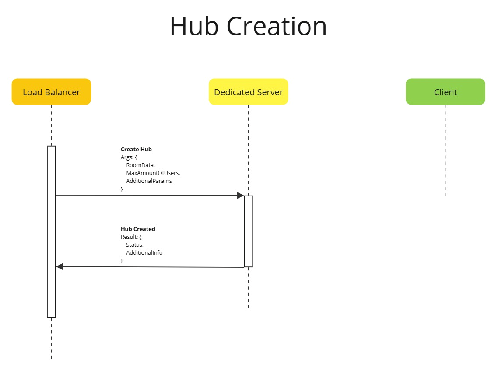
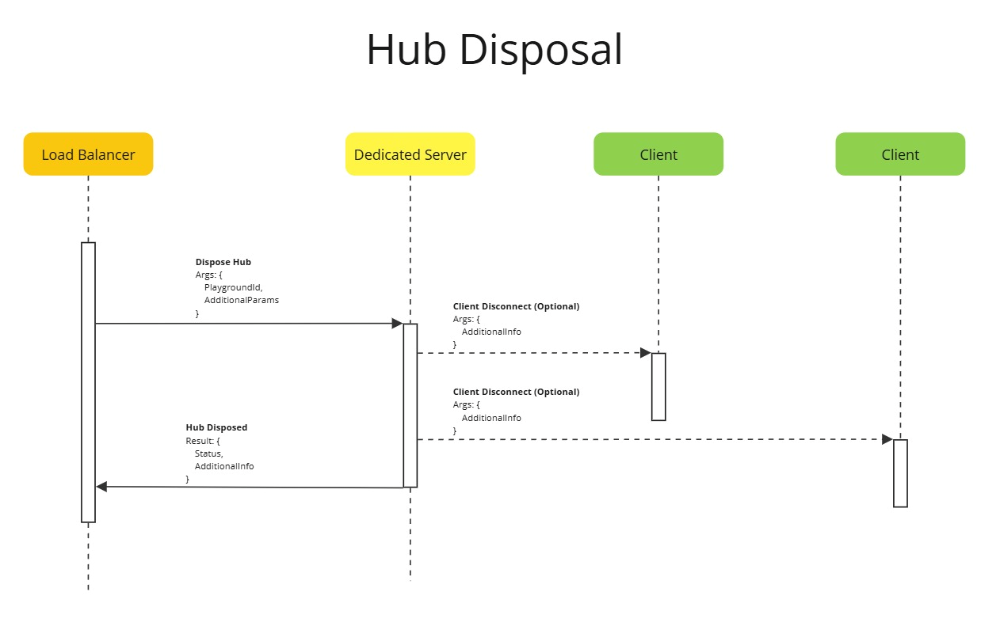
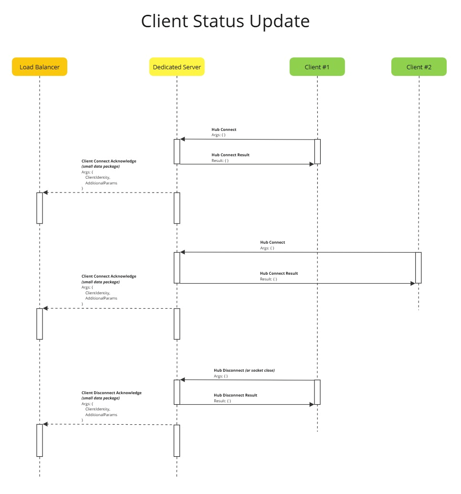
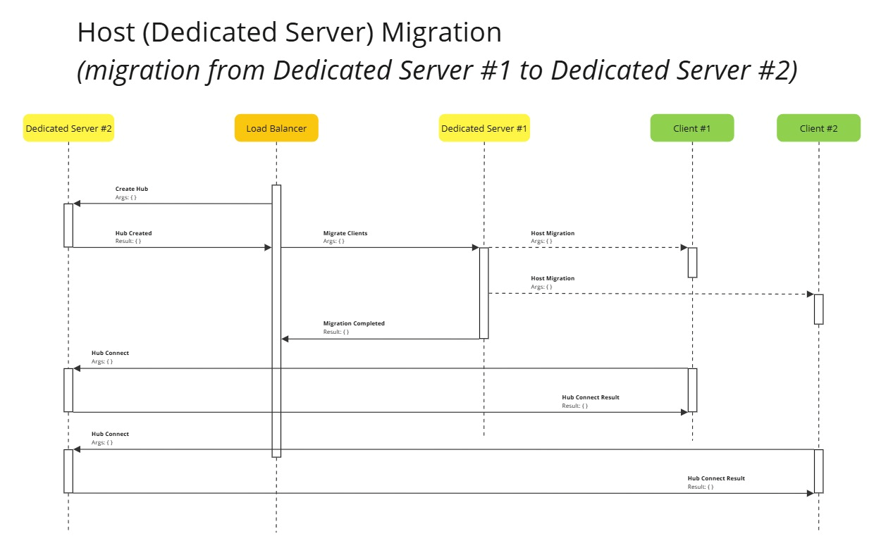

## Netcode Architecture Overview

This document describes the internal architecture and mechanisms of the Netcode implementation used in the project.
It outlines how client connections are established and maintained, how communication hubs are created and disposed, and how client state and host migration are handled.

### 1. Connection Flow

The client connection process defines how a new client initializes communication with the host or server, including the authentication, handshake, and synchronization stages.

Key stages:

Initialization – The client initializes its network interface and requests connection parameters.

Handshake – A bidirectional handshake is performed to validate connection and version compatibility.

Session Registration – The client is registered within the session context and receives its unique network ID.

Synchronization – Initial state is synchronized to align the client’s view with the current network world.

### 2. Hub Lifecycle

Hubs serve as logical units for managing communication and synchronization between clients participating in a shared context.

### 2.1 Hub Creation

Key concepts:

A hub represents a shared simulation context (e.g., a game room or instance).

On creation, the hub allocates resources and subscribes clients to its message channels.

The system ensures deterministic initialization so all clients receive a consistent state.

### 2.2 Hub Disposal

Key concepts:

Disposal occurs when the hub becomes empty or is explicitly closed by the host.

All pending messages are flushed and resources are released.

Clients are unsubscribed and their references are cleaned up from the session registry.

### 3. Client Status Management

The Netcode layer continuously tracks client status and ensures consistency across participants.

Responsibilities:

Detecting connection loss or latency spikes.

Updating availability, readiness, or in-game states.

Broadcasting status changes to other connected peers.

### 4. Host Migration

Host migration ensures session continuity when the current host disconnects or fails.

Process:

Detect host disconnection or timeout.

Elect a new host using predefined criteria (e.g., lowest latency or client ID).

Reassign authority and reinitialize session channels.

Resume state replication seamlessly to prevent desynchronization.

### 5. Summary

The Netcode system provides a modular and resilient foundation for real-time communication and state synchronization.
Each mechanism — connection, hub lifecycle, client updates, and host migration — is designed to handle transient network conditions gracefully while maintaining deterministic state across clients.
