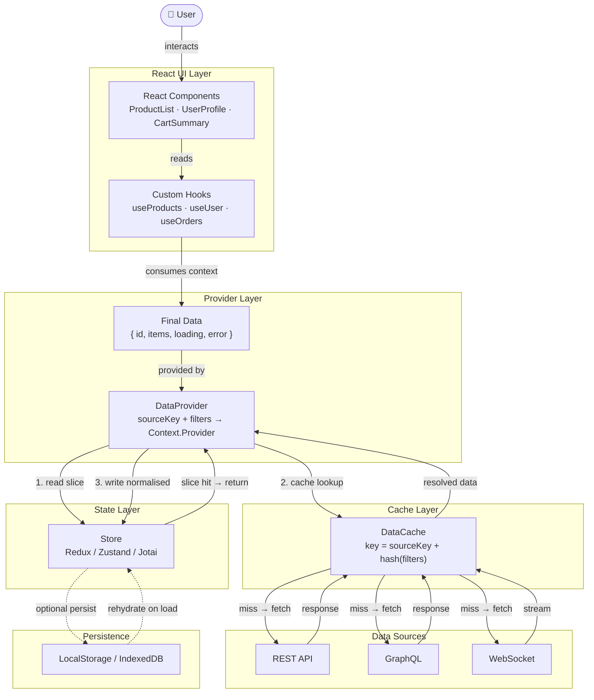
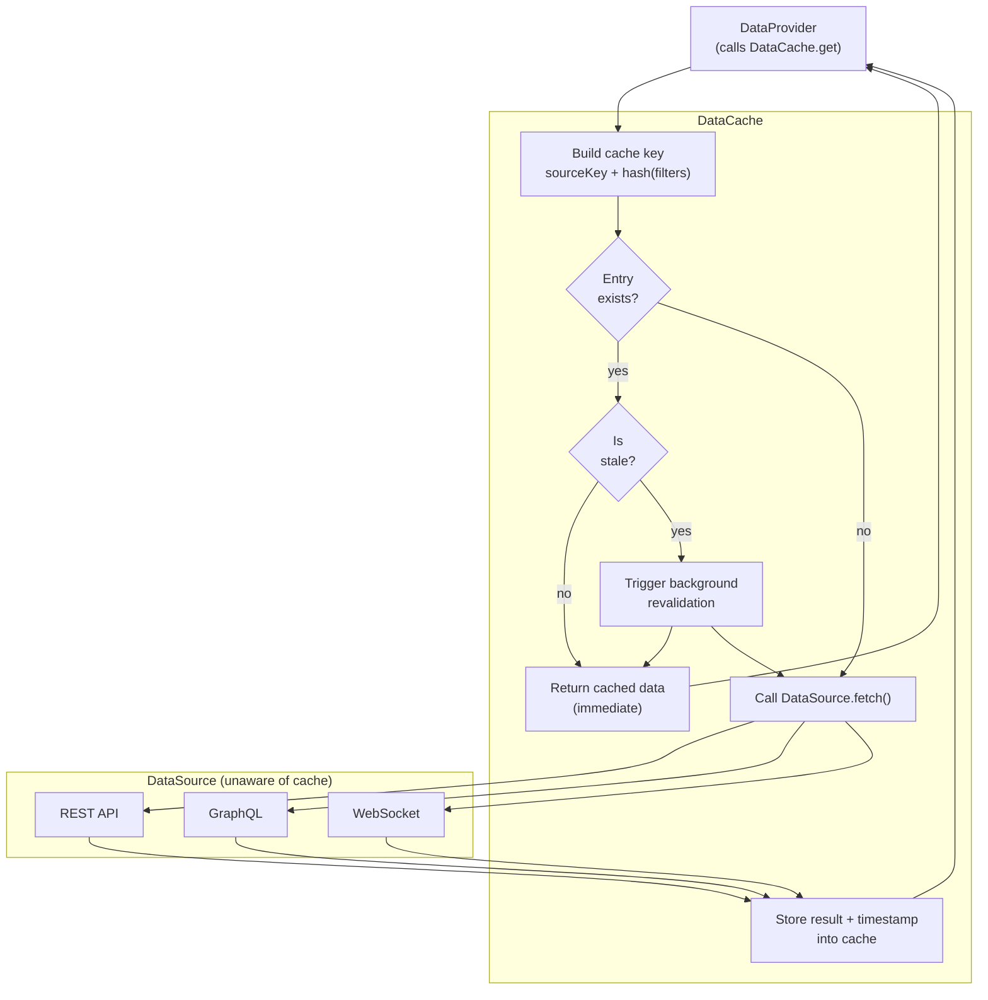
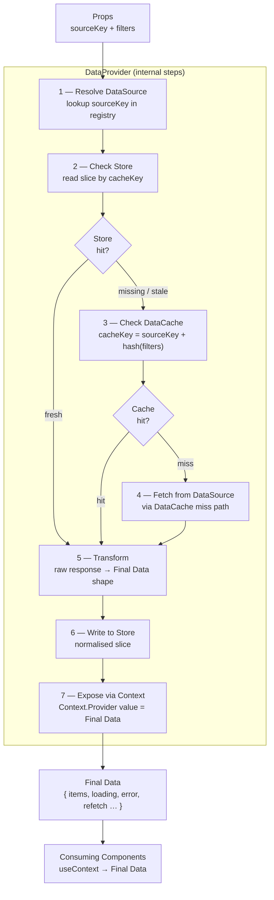
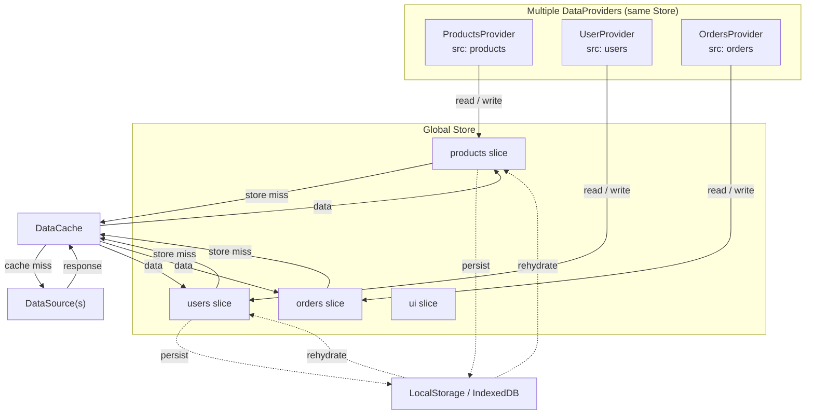

# React Data Architecture — Specification

> **Purpose:** This document defines the canonical data architecture for React
> applications. It is intended as both a developer reference and a Claude Code
> skill — giving Claude (and human developers) a shared vocabulary, precise
> definitions, interaction rules, and implementation guidance for every
> data-related component in the stack.

---

## Table of Contents

1. [Concept Overview](#1-concept-overview)
2. [Component Definitions](#2-component-definitions)
   - 2.1 [User](#21-user)
   - 2.2 [React Components](#22-react-components)
   - 2.3 [Custom Hooks](#23-custom-hooks)
   - 2.4 [Final Data](#24-final-data)
   - 2.5 [DataProvider](#25-dataprovider)
   - 2.6 [Store](#26-store)
   - 2.7 [DataCache](#27-datacache)
   - 2.8 [DataSource](#28-datasource)
   - 2.9 [Persistence Layer](#29-persistence-layer)
3. [Architecture Diagrams](#3-architecture-diagrams)
   - 3.1 [Full System Flow](#31-full-system-flow)
   - 3.2 [DataCache and DataSource Relationship](#32-datacache-and-datasource-relationship)
   - 3.3 [DataProvider Internals](#33-dataprovider-internals)
   - 3.4 [DataProviders and Store Relationship](#34-dataproviders-and-store-relationship)
4. [Interaction Rules](#4-interaction-rules)
5. [Data Flow — Step by Step](#5-data-flow--step-by-step)
6. [Final Data Contract](#6-final-data-contract)
7. [Cache Key Strategy](#7-cache-key-strategy)
8. [Implementation Guidance](#8-implementation-guidance)
9. [Anti-Patterns](#9-anti-patterns)
10. [Glossary](#10-glossary)

---

## 1. Concept Overview

This architecture separates React data concerns into six distinct layers.
Each layer has a single responsibility and communicates only with its
immediate neighbours.

| Layer | Responsibility |
|---|---|
| **User** | Triggers UI interactions |
| **React Components + Hooks** | Render UI, read Final Data via context |
| **DataProvider** | Orchestrates fetching; exposes Final Data via Context |
| **Store** | Normalised global state; checked before cache |
| **DataCache** | Keyed cache; wraps DataSource calls |
| **DataSource** | Raw data origin (REST, GraphQL, WebSocket, etc.) |
| **Persistence** | Optional long-lived storage (localStorage, IndexedDB) |

**Core principle:** Data flows upward through the layers. Writes flow downward
into the Store. The Store is always checked before the cache. The cache is
always checked before the network.

---

## 2. Component Definitions

### 2.1 User

The human (or automated agent) interacting with the application.
User actions — clicks, form submissions, navigation — trigger component
re-renders or explicit refetch calls that start the data flow.

**Interacts with:** React Components only. The user never directly touches
DataProviders, the Store, or DataSources.

---

### 2.2 React Components

Standard React function components. Their sole data responsibility is to
**read** Final Data from the nearest DataProvider via a custom hook or
`useContext`. They must not fetch, cache, or transform data themselves.

```tsx
// Good — reads from context only
function ProductList() {
  const { items, loading, error } = useProducts();
  if (loading) return <Spinner />;
  if (error)   return <ErrorBanner error={error} />;
  return <ul>{items.map(p => <li key={p.id}>{p.name}</li>)}</ul>;
}
```

**Rules:**
- No `fetch()` or axios calls inside components.
- No direct Store selectors inside components — go through the hook.
- Must handle `loading`, `error`, and empty-state from Final Data.

---

### 2.3 Custom Hooks

Thin wrappers around `useContext` that give components a typed, named
interface to Final Data. A hook maps directly to one DataProvider's context.

```ts
// useProducts.ts
export function useProducts() {
  const ctx = useContext(ProductsContext);
  if (!ctx) throw new Error('useProducts must be inside ProductsProvider');
  return ctx; // returns Final Data shape
}
```

**Rules:**
- One hook per DataProvider.
- No fetch logic — the hook is a context accessor only.
- Throw a clear error when used outside its Provider.

---

### 2.4 Final Data

The **shaped, typed output** that a DataProvider exposes via Context. It is the
only thing components ever see. Raw API responses are never passed directly to
components.

Final Data is always a flat object of **named key-value pairs** plus a standard
set of operational keys:

```ts
// Generic Final Data shape
interface FinalData<T> {
  // Business data — shape varies by provider
  data: T;

  // Operational keys — always present
  loading: boolean;     // true during first fetch
  refreshing: boolean;  // true during background revalidation
  error: Error | null;  // last error, or null
  updatedAt: number;    // timestamp of last successful fetch (ms)

  // Actions
  refetch: () => void;  // manually trigger a fresh fetch
  reset: () => void;    // clear data and return to initial state
}
```

**Example — Products Final Data:**

```ts
interface ProductsFinalData {
  items: Product[];
  totalCount: number;
  hasNextPage: boolean;
  loading: boolean;
  refreshing: boolean;
  error: Error | null;
  updatedAt: number;
  refetch: () => void;
  reset: () => void;
}
```

**Rules:**
- Never expose raw API response shapes — always transform first.
- `loading` is `true` only on the *first* fetch (no cached data yet).
- `refreshing` is `true` on background revalidation (data is stale but present).
- `error` is the *last* error; it is cleared on the next successful fetch.

---

### 2.5 DataProvider

The **orchestrator**. A DataProvider is a React component that:

1. Accepts a `sourceKey` (which DataSource to use) and `filters`
   (what subset to request).
2. Checks the **Store** first — if the relevant slice is fresh, skips
   the cache entirely.
3. Checks the **DataCache** — if a valid entry exists, returns it
   immediately.
4. Falls through to the **DataSource** on a cache miss.
5. **Transforms** the raw response into the Final Data shape.
6. Writes normalised data back to the **Store**.
7. Exposes Final Data via `Context.Provider`.

```tsx
// Simplified DataProvider structure
function ProductsProvider({
  filters,
  children,
}: {
  filters: ProductFilters;
  children: ReactNode;
}) {
  const cacheKey = buildCacheKey('products', filters);
  const storeSlice = useStore(s => s.products[cacheKey]);
  const [finalData, setFinalData] = useState<ProductsFinalData>(initial);

  useEffect(() => {
    if (storeSlice && !isStale(storeSlice)) {
      setFinalData(transform(storeSlice));
      return;
    }
    setFinalData(prev => ({ ...prev, loading: !prev.data }));
    DataCache.get('products', filters)
      .then(raw => {
        const shaped = transform(raw);
        store.dispatch(setProducts({ key: cacheKey, data: raw }));
        setFinalData(shaped);
      })
      .catch(err => setFinalData(prev => ({ ...prev, error: err, loading: false })));
  }, [cacheKey]);

  return (
    <ProductsContext.Provider value={finalData}>
      {children}
    </ProductsContext.Provider>
  );
}
```

**Props a DataProvider accepts:**

| Prop | Type | Purpose |
|---|---|---|
| `sourceKey` | `string` | Identifies which DataSource to target |
| `filters` | `object` | Narrowing parameters (pagination, category, userId…) |
| `ttl` | `number?` | Override cache TTL for this provider instance |
| `pollInterval` | `number?` | Enable background polling (ms) |
| `children` | `ReactNode` | The subtree that consumes this provider's context |

---

### 2.6 Store

Global, normalised, reactive state. The Store holds the application's
**single source of truth** for all server-derived data.

**Technology choices:** Redux Toolkit, Zustand, Jotai, or Recoil.

**Structure — normalised slices:**

```ts
// Store shape
interface AppStore {
  products: Record<string, CachedSlice<Product[]>>;
  users:    Record<string, CachedSlice<User>>;
  orders:   Record<string, CachedSlice<Order[]>>;
  ui:       UIState;
}

interface CachedSlice<T> {
  data: T;
  fetchedAt: number;  // ms timestamp
  ttl: number;        // ms — 0 means never stale
}
```

**Relationship to DataProvider:**

- DataProvider **reads** from the Store before hitting the cache.
- DataProvider **writes** to the Store after a successful fetch.
- A write by `OrdersProvider` automatically triggers re-renders in any
  component subscribed to the `orders` slice — even through a different
  provider instance.

**Relationship to Persistence:**

- The Store optionally persists selected slices to `localStorage` or
  `IndexedDB` (via middleware such as `redux-persist` or `zustand/middleware`).
- On app load, persisted slices **rehydrate** the Store before the first
  DataProvider mount.

---

### 2.7 DataCache

An in-memory (or session-scoped) request cache that sits between the
DataProvider and the DataSource. It exists to prevent redundant network calls.

**Cache key formula:**

```
cacheKey = sourceKey + ":" + stableStringify(filters)
```

`stableStringify` sorts object keys before serialising so that
`{ b:2, a:1 }` and `{ a:1, b:2 }` produce the same key.

**Lookup logic:**

```
get(sourceKey, filters):
  key = buildKey(sourceKey, filters)
  entry = cache.get(key)

  if entry exists AND entry is not stale:
    return entry.data              // HIT

  if entry exists AND entry is stale:
    triggerBackgroundRevalidation(key)
    return entry.data              // STALE-WHILE-REVALIDATE

  data = await DataSource.fetch(sourceKey, filters)
  cache.set(key, { data, fetchedAt: now(), ttl: DEFAULT_TTL })
  return data                      // MISS → fetched and stored
```

**Rules:**
- Multiple DataProvider instances with the same `sourceKey` + `filters`
  share **one** cache entry. Only one network call is made.
- DataSource has no knowledge that the cache exists.
- Cache entries can be invalidated explicitly (e.g., after a mutation).

---

### 2.8 DataSource

The raw data origin. A DataSource knows how to speak to one specific backend
or protocol. It accepts a `sourceKey` + `filters` and returns raw, untyped
data. It does not cache, transform, or normalise.

**Built-in DataSource types:**

| Type | Use case |
|---|---|
| `RestDataSource` | Standard HTTP REST endpoints |
| `GraphQLDataSource` | GraphQL queries and mutations |
| `WebSocketDataSource` | Real-time streaming data |
| `IndexedDBDataSource` | Large offline-first datasets |
| `LocalStorageDataSource` | Small key-value persistence |
| `MockDataSource` | Testing and Storybook development |

**DataSource interface:**

```ts
interface DataSource {
  key: string;                             // matches sourceKey in DataProvider
  fetch(filters: Record<string, unknown>): Promise<unknown>;
  subscribe?(filters: Record<string, unknown>,
             callback: (data: unknown) => void): () => void;
}
```

**Registration — DataSource registry:**

```ts
// All DataSources are registered at app startup
DataSourceRegistry.register([
  new RestDataSource('products',  '/api/products'),
  new RestDataSource('users',     '/api/users'),
  new GraphQLDataSource('orders', ORDERS_QUERY),
  new WebSocketDataSource('feed', 'wss://api.example.com/feed'),
]);
```

The registry is the only place that knows which `sourceKey` maps to which
endpoint. DataProviders never hardcode URLs.

---

### 2.9 Persistence Layer

Optional long-lived storage that survives page reload. Used for:

- Offline-first capability.
- Reducing cold-start load time (rehydrate Store before first fetch).
- User preferences and UI state.

**Technologies:**

| Store | Best for |
|---|---|
| `localStorage` | Small JSON (<5 MB), synchronous |
| `IndexedDB` | Large structured data, binary, async |
| `sessionStorage` | Tab-scoped temporary data |
| `Cache API` | Network response caching (PWA) |

**Rehydration flow:**

```
App startup
  → read persisted slices from localStorage / IndexedDB
  → dispatch REHYDRATE action to Store
  → Store now contains stale-but-valid data
  → DataProviders mount → check Store → data present → skip network
  → background revalidation fetches fresh data silently
```

---

## 3. Architecture Diagrams

### 3.1 Full System Flow



---

### 3.2 DataCache and DataSource Relationship



---

### 3.3 DataProvider Internals



---

### 3.4 DataProviders and Store Relationship



---

## 4. Interaction Rules

These rules govern how every layer is allowed to communicate with others.

| Rule | Description |
|---|---|
| **R1** | Components never call `fetch()` or access the Store directly. |
| **R2** | Components read data only through custom hooks backed by DataProvider context. |
| **R3** | DataProvider always checks the Store before the DataCache. |
| **R4** | DataProvider always checks the DataCache before the DataSource. |
| **R5** | DataSource has no knowledge of the cache or the Store. |
| **R6** | DataCache has no knowledge of the Store or components. |
| **R7** | Two DataProvider instances with identical `sourceKey` + `filters` share one cache entry and one Store slice. |
| **R8** | After any successful fetch, the DataProvider writes normalised data to the Store. |
| **R9** | The Store may persist to `localStorage`/`IndexedDB` but only for selected, explicitly allowlisted slices. |
| **R10** | Final Data shapes are defined in TypeScript interfaces; raw API shapes are never exported outside the DataProvider. |

---

## 5. Data Flow — Step by Step

### Happy path (cold start, no cache, no store)

```
1.  User clicks "View Products"
2.  ProductList renders → calls useProducts()
3.  useProducts() reads ProductsContext → Final Data { loading: true }
4.  ProductsProvider mounts with sourceKey="products", filters={category:"hats"}
5.  DataProvider checks Store → products slice empty → miss
6.  DataProvider calls DataCache.get("products", {category:"hats"})
7.  DataCache builds key: "products:abc123"
8.  DataCache → no entry found → MISS
9.  DataCache calls DataSourceRegistry.get("products").fetch({category:"hats"})
10. REST API returns raw JSON array
11. DataCache stores response under "products:abc123" with TTL
12. DataCache returns raw data to DataProvider
13. DataProvider transforms raw → ProductsFinalData shape
14. DataProvider dispatches normalised data to Store → products["products:abc123"]
15. DataProvider updates Context value → Final Data { items:[...], loading:false }
16. ProductList re-renders with items
```

### Warm path (Store hit)

```
1–4. Same as above
5.  DataProvider checks Store → products["products:abc123"] exists, fresh
6.  DataProvider transforms Store slice → Final Data immediately
7.  No DataCache or DataSource involved
8.  ProductList renders with cached items in one synchronous pass
```

### Stale-while-revalidate path

```
1–4. Same as above
5.  DataProvider checks Store → slice exists but stale (age > TTL)
6.  DataProvider transforms stale slice → Final Data { items:[...], refreshing:true }
7.  ProductList renders immediately with stale items (no spinner)
8.  In background: DataCache triggers fresh fetch from DataSource
9.  Fresh data arrives → Store updated → DataProvider updates context
10. ProductList re-renders silently with fresh items
```

---

## 6. Final Data Contract

Every DataProvider must expose a value conforming to this contract.
The business-data fields (`data`, or named equivalents) vary by provider;
the operational keys are **mandatory and fixed**.

```ts
// Base contract — all providers
interface FinalDataBase {
  loading:    boolean;      // true only on first fetch (no data yet)
  refreshing: boolean;      // true during background revalidation
  error:      Error | null; // last error, null on success
  updatedAt:  number;       // Date.now() of last successful fetch
  refetch:    () => void;   // force fresh fetch, bypassing cache
  reset:      () => void;   // clear to initial state
}

// Example — Products provider extends base
interface ProductsFinalData extends FinalDataBase {
  items:       Product[];
  totalCount:  number;
  hasNextPage: boolean;
  fetchNextPage: () => void;
}

// Example — User provider
interface UserFinalData extends FinalDataBase {
  user: User | null;
}
```

---

## 7. Cache Key Strategy

Cache keys must be **stable**, **unique per logical request**, and
**collision-free** across different DataSources.

```ts
function buildCacheKey(
  sourceKey: string,
  filters: Record<string, unknown>
): string {
  // Sort keys so { b:2, a:1 } === { a:1, b:2 }
  const stableFilters = JSON.stringify(
    Object.fromEntries(
      Object.entries(filters).sort(([a], [b]) => a.localeCompare(b))
    )
  );
  return `${sourceKey}:${stableFilters}`;
}

// Examples
buildCacheKey("products", { category: "hats", page: 1 })
// → "products:{"category":"hats","page":1}"

buildCacheKey("users", { id: "u_42" })
// → "users:{"id":"u_42"}"
```

**TTL defaults (recommended):**

| Data type | TTL |
|---|---|
| User profile | 5 minutes |
| Product listings | 2 minutes |
| Real-time feed | 0 (no cache — use WebSocket) |
| Reference/enum data | 30 minutes |
| Static config | 1 hour |

---

## 8. Implementation Guidance

### File structure

```
src/
  data/
    sources/
      RestDataSource.ts
      GraphQLDataSource.ts
      WebSocketDataSource.ts
      registry.ts             ← registers all DataSources at startup
    cache/
      DataCache.ts            ← singleton cache implementation
      cacheKey.ts             ← buildCacheKey utility
    providers/
      ProductsProvider.tsx    ← one file per DataProvider
      UserProvider.tsx
      OrdersProvider.tsx
      index.ts                ← re-exports all providers
    hooks/
      useProducts.ts          ← one hook per provider
      useUser.ts
      useOrders.ts
    store/
      index.ts                ← Store setup (Zustand / Redux)
      slices/
        productsSlice.ts
        usersSlice.ts
        ordersSlice.ts
    types/
      finalData.ts            ← FinalDataBase + all provider interfaces
      sources.ts              ← raw API response types
```

### Provider composition

Nest DataProviders at the appropriate level of the component tree.
Place them as **low as possible** — not globally at the app root unless
every page genuinely needs that data.

```tsx
// Good — scoped to the route that needs it
function ProductsPage() {
  const filters = useFiltersFromURL();
  return (
    <ProductsProvider filters={filters}>
      <ProductList />
      <ProductSidebar />
      <Pagination />
    </ProductsProvider>
  );
}
```

### Store setup (Zustand example)

```ts
// store/index.ts
import { create } from 'zustand';
import { persist } from 'zustand/middleware';

export const useStore = create(
  persist(
    (set, get) => ({
      products: {} as Record<string, CachedSlice<Product[]>>,
      users:    {} as Record<string, CachedSlice<User>>,
      orders:   {} as Record<string, CachedSlice<Order[]>>,

      setSlice: <T>(ns: string, key: string, data: T) =>
        set(s => ({ [ns]: { ...s[ns], [key]: { data, fetchedAt: Date.now(), ttl: 120_000 } } })),

      getSlice: (ns: string, key: string) =>
        get()[ns]?.[key] ?? null,
    }),
    {
      name: 'app-store',
      partialize: (s) => ({ users: s.users }), // only persist users slice
    }
  )
);
```

### Cache invalidation after mutation

```ts
// After a successful POST/PUT/DELETE, invalidate affected cache entries
async function updateProduct(id: string, patch: Partial<Product>) {
  await api.patch(`/products/${id}`, patch);

  // Invalidate all cache entries whose key starts with "products:"
  DataCache.invalidateByPrefix('products:');

  // Also clear the Store slice so next DataProvider mount refetches
  store.getState().clearNamespace('products');
}
```

---

## 9. Anti-Patterns

| Anti-pattern | Why it's wrong | Correct approach |
|---|---|---|
| Fetching inside a component | Bypasses cache and Store; causes waterfall re-renders | Move fetch logic into DataProvider |
| Accessing Store directly in a component | Couples component to global state shape | Go through the custom hook → DataProvider context |
| Hardcoding API URLs in DataProvider | Breaks registry pattern; hard to mock | Register URLs in DataSource registry |
| Using `loading` and `refreshing` interchangeably | Causes unnecessary full-page spinners during background revalidation | Show spinner only when `loading`, show subtle indicator when `refreshing` |
| Exposing raw API types as Final Data | Couples UI to backend shape; breaks on API change | Always define and transform to a stable Final Data interface |
| Single global Provider wrapping the whole app | Forces all data to load on every page | Scope each Provider to the route/section that needs it |
| Cache keys without stable serialisation | `{b:2,a:1}` and `{a:1,b:2}` treated as different keys; duplicate fetches | Use `buildCacheKey` with sorted key serialisation |
| No error boundary around Providers | Uncaught promise rejections crash the whole tree | Wrap each Provider in an `<ErrorBoundary>` |

---

## 10. Glossary

| Term | Definition |
|---|---|
| **DataSource** | A connector to a single raw data origin (REST, GraphQL, WebSocket, etc.). Returns untyped raw data. Knows nothing about caching or the Store. |
| **DataCache** | An in-memory cache keyed by `sourceKey + hash(filters)`. Wraps DataSource calls. Implements TTL and stale-while-revalidate. |
| **DataProvider** | A React component that orchestrates fetching (via Store → Cache → Source), transforms data, and exposes Final Data via Context. |
| **sourceKey** | A string identifier (e.g. `"products"`) that maps to a registered DataSource in the DataSourceRegistry. |
| **filters** | A plain object of parameters passed to DataProvider that narrow the data request (e.g. `{ category: "hats", page: 2 }`). |
| **Final Data** | The typed, shaped output of a DataProvider, consumed by components via custom hooks. Always includes `loading`, `refreshing`, `error`, `updatedAt`, `refetch`, and `reset`. |
| **Store** | Global normalised reactive state (Redux / Zustand / Jotai). Checked before the DataCache. Receives normalised writes after every successful fetch. |
| **Cache key** | The string `sourceKey + ":" + stableStringify(filters)` used as the cache entry identifier. |
| **Stale-while-revalidate** | A caching strategy where stale data is returned immediately while a fresh fetch runs in the background. |
| **Persistence layer** | Optional `localStorage`/`IndexedDB` storage for Store slices, enabling offline use and cold-start performance. |
| **Custom hook** | A thin `useContext` wrapper (e.g. `useProducts`) that gives components a typed, named interface to a DataProvider's Final Data. |
| **Normalised data** | Data stored in the Store with entities keyed by ID rather than duplicated across multiple response shapes. |
| **TTL (Time-to-live)** | The duration in milliseconds after which a cache or Store entry is considered stale and eligible for revalidation. |
